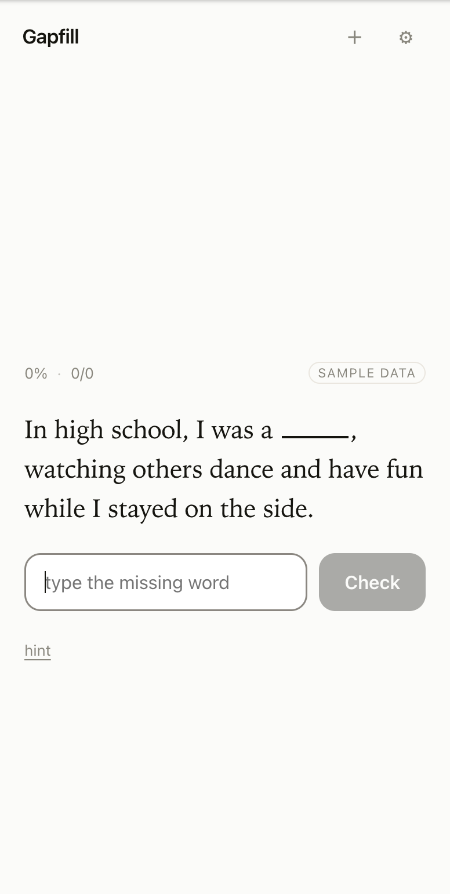
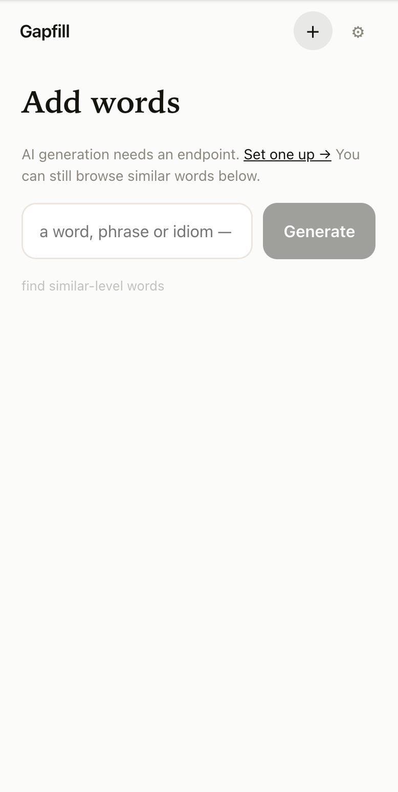
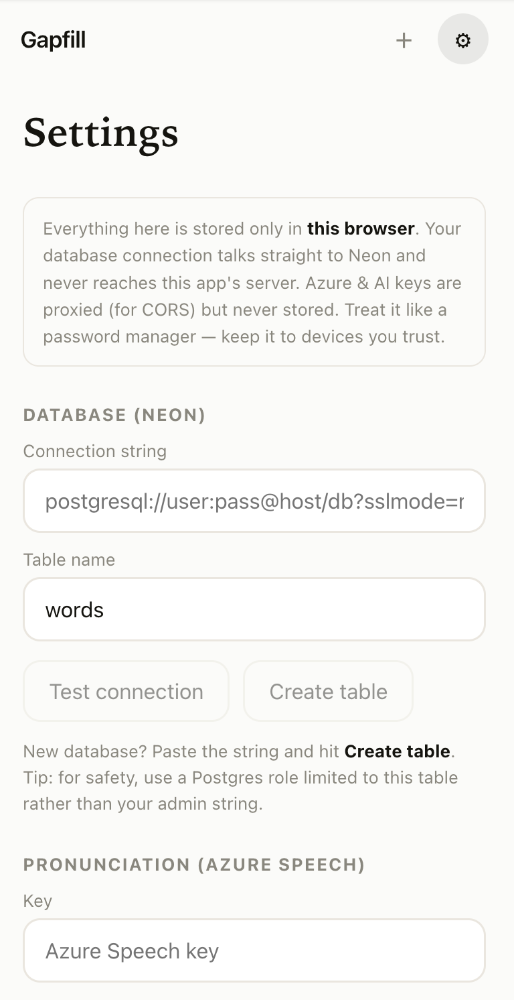

# vocabulary and pronunciation building app

ok so this is a small thing i built to get better at english. you get a sentence with one word taken out and you have to type the missing word, thats basically the whole idea. the sentences arent the dry dictionary kind, they actually mean something and a few of them are honestly a bit funny which is the point cause i remember those way better

inside the app its called gapfill, no real reason the name just stuck

## what it does

- shows you a sentence with a gap, you type the word, green if you got it right red if you didnt
- it keeps track of what you keep messing up and shows those words more often, so your not wasting time on stuff you already know
- pronunciation. you tap the little mic, say the word out loud and it scores you. and not just an overall number, it goes sound by sound (phoneme) and colors each bit green orange or red. thats azure speech doing the work
- adding words. you type any word phrase or idiom and the ai writes a definition plus a few interesting example sentences, you can edit them before you save. theres also a "find similar words" thing for when you dont know what to add next

## the bring your own keys thing

theres no server keeping any of your stuff, that was kind of the whole point. you go into settings and drop in:

- your neon database connection (this one talks straight from your browser to neon, it never even touches the app server)
- an azure speech key if you want the pronunciation scoring
- any openai compatible endpoint + key if you want the ai to write sentences for you

all of that just lives in your own browser. so you can host this once and other people can use it with their own databases and keys and you never see any of it. only catch is the azure and ai calls have to go through the server cause of cors, so those keys pass through on the way to the provider but nothing is saved or logged

first time setup is quick, paste your neon string in settings and hit create table and your done. or just test connection if you already made the table

> small warning, its stored in the browser so treat the settings screen like a password manager, only put it on devices you trust. and honestly use a limited postgres role instead of your admin connection just in case

## running it

```
npm install
npm run dev
```

then open the link it prints. with nothing configured it runs on a couple of sample words so you can have a look around before connecting anything

## a few screenshots

<p>
  
  
  
</p>

## deploying it

just push it to vercel and thats it, no env variables to mess with since everything lives in the browser. its also a pwa so on the iphone you can do share > add to home screen and it opens fullscreen like a normal app, no weird scroll bounce or zoom stuff

---

thats pretty much it. made it for myself really but if it ends up helping you then nice
